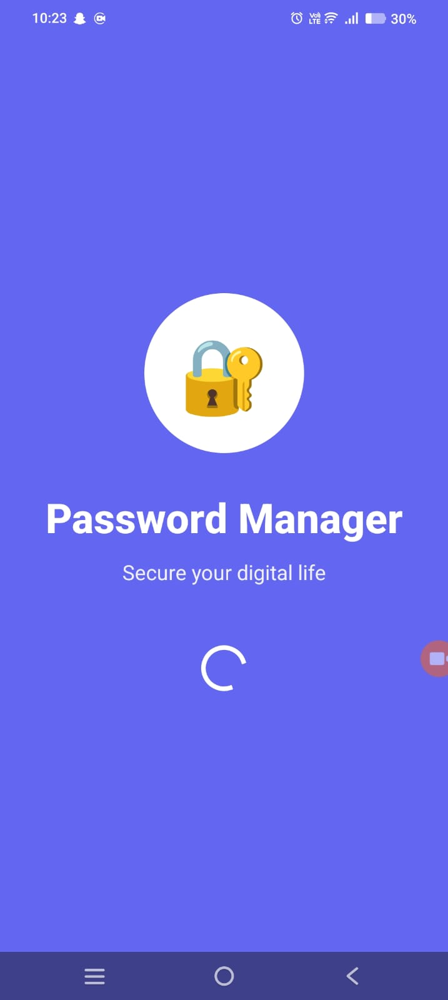
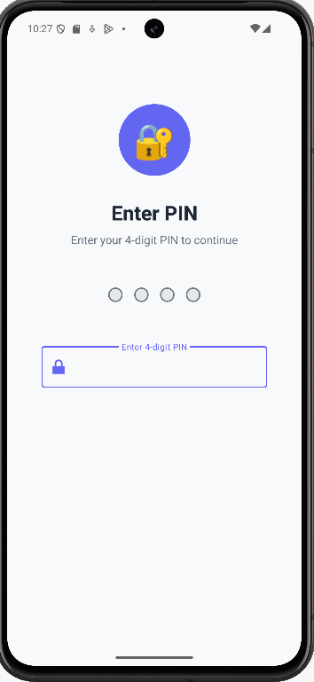
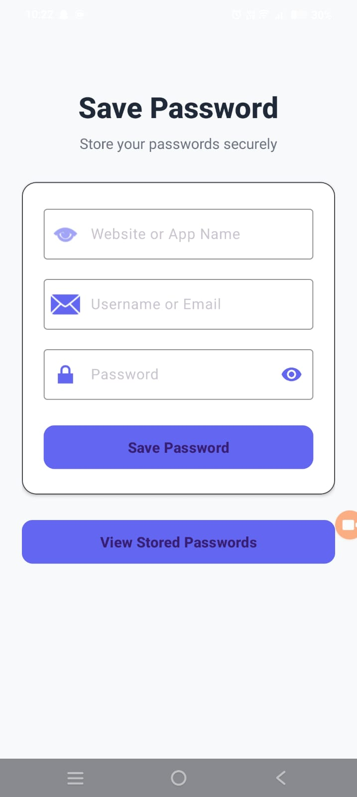
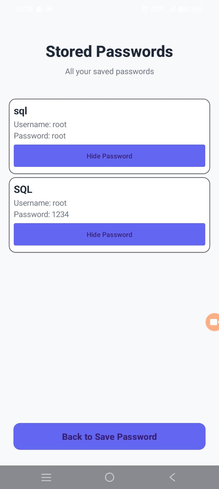

# 🔐 Password Manager App

A simple and secure **Password Manager** application that allows users to safely store and manage their credentials using an **8-digit PIN or Biometric (Fingerprint) login system**.

The app focuses on ease of use while maintaining basic security principles for personal password storage.

---

## 📱 App Flow Overview

The application is built using **Jetpack Compose** and consists of **4 main screens**:

1. **Splash Screen** ([SplashScreen.kt](file:///app/src/main/java/com/example/passwordmanager/ui/screens/SplashScreen.kt)) - Initial branding with animated progress.
2. **Login Screen** ([LoginScreen.kt](file:///app/src/main/java/com/example/passwordmanager/ui/screens/LoginScreen.kt)) - 8-digit PIN or Biometric authentication.
3. **Dashboard** ([DashboardScreen.kt](file:///app/src/main/java/com/example/passwordmanager/ui/screens/DashboardScreen.kt)) - Overview of saved passwords and security health.
4. **All Stored Passwords** ([StoredPasswordsScreen.kt](file:///app/src/main/java/com/example/passwordmanager/ui/screens/StoredPasswordsScreen.kt)) - Management of all saved credentials.

---

## ✨ Features

### 🚀 Modern UI (Jetpack Compose)
- Fully reactive UI built with Google's latest toolkit.
- Material 3 design with dark mode support.
- Smooth animations and transitions.

### 🔢 8-digit PIN & Biometric Authentication
- Secure login with an 8-digit PIN.
- Fast access via Fingerprint (Biometric) authentication.
- Visual feedback with progress tracking on splash.

### ➕ Dashboard & Management
- Categorized password storage (Social, Banking, Work).
- Security health indicator.
- One-tap copy to clipboard.
- masked password fields for privacy.

---

## 🛡️ Security Considerations

- **Local Storage**: All data is stored locally on the device.
- **Biometric Security**: Leverages Android BiometricPrompt for secure access.
- **No Cloud Sync**: Your passwords never leave your device.

⚠️ This app is intended for **learning and personal use**.

---

## 🧰 Tech Stack

- **Platform:** Android
- **UI Framework:** Jetpack Compose (Material 3)
- **Language:** Kotlin
- **Storage:** Room Database
- **Architecture:** MVVM / Modern Android Architecture

---

## 📂 Project Structure
 ```
PasswordManager/
├── app/src/main/java/com/example/passwordmanager/
│ ├── ui/
│ │ ├── screens/ (Compose Screens)
│ │ └── theme/   (Colors, Typography, Theme)
│ ├── MainActivity.kt
│ ├── LoginActivity.kt
│ ├── StoreActivity.kt
│ └── storageActivity2.kt
├── res/ (Minimal resources, mostly icons)
├── README.md
└── AndroidManifest.xml
 ```

---

## 📸 App Screenshots

<p align="center">
  
  
  
  
</p>

<p align="center">
  <b>Splash Screen</b> &nbsp;&nbsp;&nbsp;
  <b>Login</b> &nbsp;&nbsp;&nbsp;
  <b>Dashboard</b> &nbsp;&nbsp;&nbsp;
  <b>All Passwords</b>
</p>

---

## 🛠️ Installation

1. Clone the repository:
   ```bash
    git clone https://github.com/Vinay-ops/Password_Manager
   ```

2. Open the project in Android Studio (Iguana or newer recommended).

3. Build and run the app.

---

## 🧪 Usage

1. Launch the app and wait for core initialization.
2. Enter your 8-digit PIN or use Biometric login.
3. Access your Dashboard to view categories.
4. Manage all passwords from the Vault screen.

---

## 👤 Author

**Vinay Bhogal**  
Student Developer | Android App Development

---

